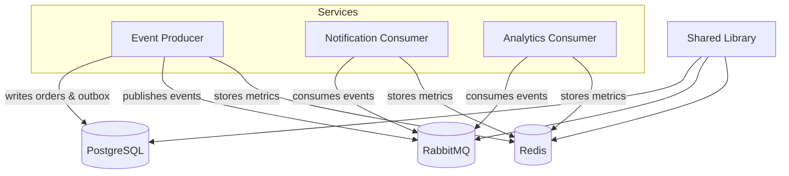

# miyabi
Intern ID: CITS670

---

## Table of Contents
- [Overview](#overview)
- [Architecture](#architecture)
- [Prerequisites](#prerequisites)
- [Setup](#setup)
- [Running Services](#running-services)
- [Testing](#testing)
- [API Reference](#api-reference)
- [Contributing](#contributing)
- [License](#license)

---

## Overview

`miyabi` is a production‑grade, event‑driven microservices example built with **Node.js**, **TypeScript**, **Express**, **RabbitMQ**, **PostgreSQL** (via **Prisma**), **Redis**, and **Zod** for validation. It demonstrates the Outbox pattern, idempotent consumers, retry policies, and observable metrics.

---

## Architecture



---

## Prerequisites

- **Docker** (>= 20.10) with **docker‑compose**
- **Node.js** (>= 18) and **npm** (>= 10)
- **Git**

---

## Setup

1. **Clone the repository**
   ```bash
   git clone https://github.com/yourusername/miyabi.git
   cd miyabi
   ```
2. **Create an environment file**
   ```bash
   cp .env.example .env   # edit if you need custom ports
   ```
3. **Start infrastructure** (PostgreSQL, RabbitMQ, Redis)
   ```bash
   docker compose up -d
   ```
4. **Install dependencies**
   ```bash
   npm install
   ```
5. **Build the workspace**
   ```bash
   npm run build
   ```

---

## Running Services

Each service is a workspace package. You can start them individually:

```bash
# Event Producer (API)
cd services/event-producer
npm start   # or npm run dev for hot reload

# Notification Consumer
cd ../../services/notification-consumer
npm start

# Analytics Consumer
cd ../../services/analytics-consumer
npm start
```

The API is available at `http://localhost:3000`. Swagger UI can be accessed at `http://localhost:3000/api-docs`.

---

## Testing

The project uses **Jest** and **Supertest**. Run the full test suite:

```bash
npm test
```

Both unit tests (outbox) and integration tests (API) should pass.

---

## API Reference

The OpenAPI spec is bundled in `services/event-producer/src/openapi.json`. After starting the Event Producer, you can explore the API via Swagger UI (`/api-docs`). Key endpoints:
- `POST /orders` – create an order (validated with Zod)
- `GET /metrics` – system metrics
- `GET /health` – health check
